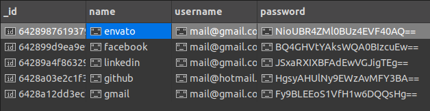

# password-manager

<p align="center">
  
</p>

This application is a free password manager where you add the `NAME` and the `EMAIL` then a `PASSWORD` will be generated and `Encrypted` before storing it in the `MONGODB` database.

### Steps to run the application:

 1. [Instal MongoDB](https://www.mongodb.com/docs/manual/tutorial/install-mongodb-on-ubuntu/)
 2. [Install Studio3T](https://studio3t.com/knowledge-base/articles/installation/)
 3. Make sure `MongoDB` is installed and running on `localhost:27017`
### Open `Studio3T` application and connect to `mongodb://localhost:27017`

 

### Connect to the database

  
  

### Run the App:
```
./passgen
```
Output:
```
Enter name for the password: gmail
Enter user name: mail@gmail.com
Generated password: n@4^lM%6-f,NdkB3
Password stored in MongoDB database with name gmail in collection passwords
```
The `Password` will be `Encrypted` as shown in the database:

 

### For `Password Decryption` run the following:
```
./decrypt
```
This will ask you about the name of the `Password` you would like to `Decrypt` and it will be revealed in the terminal as shown.

 


### To build the application:

### Install [GoLang](https://go.dev/doc/install)

`NOTE:` Make sure Go is installed by running `go version`

This will create 2 executable files one to generate the password and the other one to decrypt it.

```
go mod tidy
go build main.go encrypt.go
go build decrypt.go encrypt.go
```
